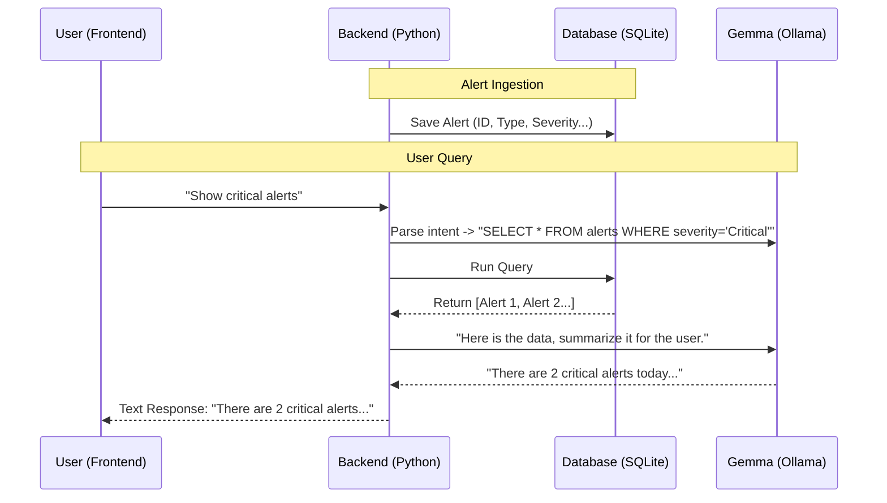

# Option 1: Backend Memory (Server-Side Storage)

## Concept
In this architecture, the **Backend** acts as the "Brain" with long-term memory.
1.  The Python service (`kafka-backend.py`) receives alerts from Kafka.
2.  It **saves** every alert into a database (e.g., SQLite, PostgreSQL).
3.  When you ask a question ("Show me critical alerts"), Gemma queries this database.
4.  Gemma formats the results into a natural language response.

## Architecture Data Flow

## Pros & Cons

### ✅ Pros
*   **True Persistence**: The AI remembers things even if you close the browser.
*   **Complex Queries**: You can ask "How many alerts happened last month?" (Frontend might not have data from last month loaded).
*   **Centralized**: All data is in one place, accessible by any client.

### ❌ Cons
*   **Duplicate Storage**: We are now storing data in Kafka *and* a new Database.
*   **Complexity**: Requires setting up and managing a database (SQL schema, migrations).
*   **Synchronization**: If an alert is deleted in the Frontend, the Backend database interacts to know about it.

## Implementation Steps
1.  **Database Setup**: Add `sqlite3` or `SQLAlchemy` to `kafka-backend.py`.
2.  **Schema**: Create a table `alerts` (id, type, severity, time, location).
3.  **Ingest**: In the Kafka loop, `INSERT` every message into the DB.
4.  **Query**:
    *   When a chat message arrives, use Gemma to convert "natural language" -> "SQL" (or filter parameters).
    *   Execute the query.
    *   Format the results back to the user.
