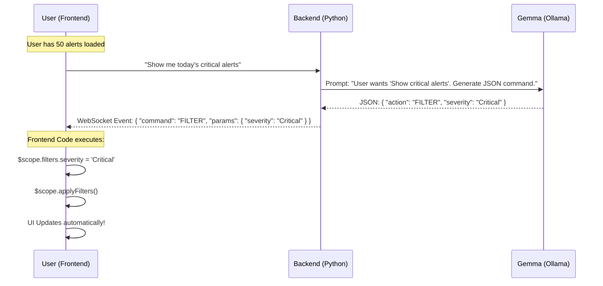

# Option 2: Agentic Frontend Control (Client-Side Logic)

## Concept
In this architecture, the **Frontend** is the "Body" and Gemma is the "Controller".
1.  The Frontend already has the alerts loaded in memory (displayed in the table).
2.  When you ask a question, the Backend **does not look at data**.
3.  Gemma understands *what you want to do* (User Intent).
4.  Gemma sends a **Command** to the Frontend.
5.  The Frontend executes the command (e.g., clicking a filter button for you).

## Architecture Data Flow

## Pros & Cons

### ✅ Pros
*   **Zero Database Latency**: No need to query a backend DB; instant UI reaction.
*   **"Magic" Feel**: The user feels like they are controlling the app with their voice/text.
*   **Simpler Backend**: `kafka-backend.py` remains a simple pass-through; no SQL logic needed.
*   **Single Source of Truth**: Uses the exact data the user is already seeing.

### ❌ Cons
*   **Limited Scope**: Can only "search" what is currently loaded in the browser. (If you want data from last year, you'd need to fetch it first).
*   **Frontend Logic**: Requires writing JavaScript handlers for every "command" (Filter, Navigate, Sort, etc.).

## Implementation Steps
1.  **Define Protocol**: Create a JSON structure for commands (e.g., `type: 'NAVIGATION' | 'FILTER' | 'ACTION'`).
2.  **Backend Prompting**:
    *   Modify the Gemma prompt: "You are a controller. If user says X, output JSON Y."
3.  **Frontend Handler**:
    *   In `nura-ai-controller.js`, listen for the JSON response.
    *   `if (response.action === 'filter') { alertsController.setFilter(...) }`.
